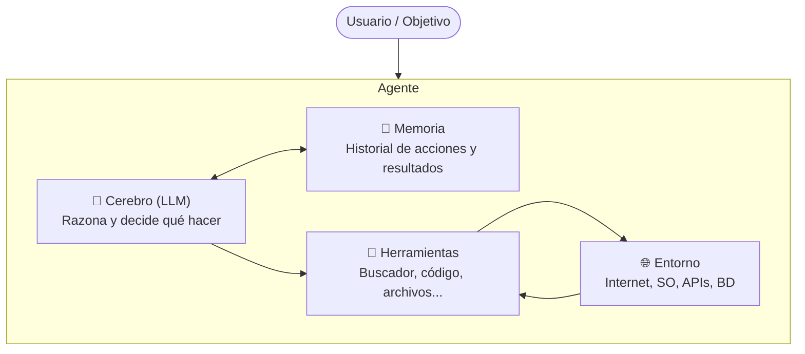
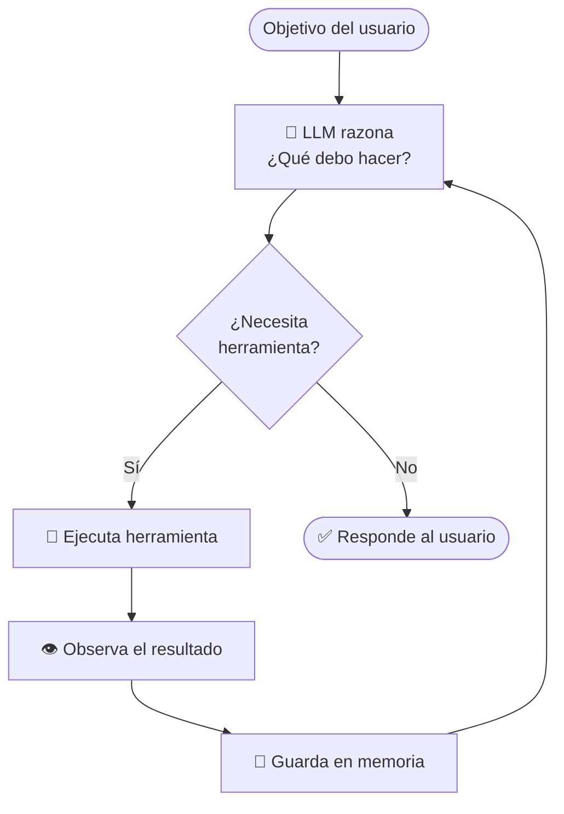
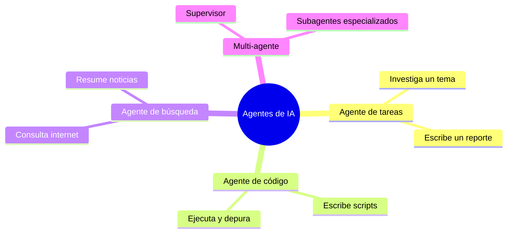
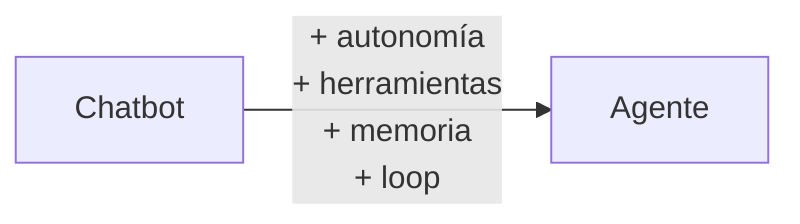

# Sesión 1 — ¿Qué es un Agente de IA?

**Fecha:** 2026-03-28
**Duración:** ~1 hora
**Estado:** ✅ Completada

---

## Objetivos

- Entender la diferencia entre un chatbot y un agente de IA.
- Conocer los 4 componentes de un agente.
- Comprender el loop agéntico.
- Ver un primer vistazo al código (pseudocódigo).

---

## 1. Chatbot vs. Agente

| | Chatbot / LLM | Agente |
|---|---|---|
| ¿Qué hace? | Responde un mensaje | Decide qué acciones tomar en un loop |
| ¿Tiene herramientas? | No | Sí (buscar, ejecutar código, leer archivos…) |
| ¿Actúa por sí solo? | No | Sí, hasta cumplir un objetivo |
| ¿Recuerda entre pasos? | No | Sí (historial de acciones y resultados) |

**Definición clave:**
> Un agente no solo responde — razona, decide cuándo y qué herramienta usar, y actúa de forma autónoma para cumplir un objetivo.

---

## 2. Los 4 Componentes de un Agente



| Componente | Rol |
|---|---|
| **Cerebro (LLM)** | Razona y decide qué hacer en cada paso |
| **Herramientas** | Puente entre el agente y el entorno (buscador, intérprete de código, lector de archivos) |
| **Memoria** | Guarda el historial de acciones y observaciones para mejorar la siguiente decisión |
| **Entorno** | El mundo externo con el que interactúa: internet, sistema de archivos, bases de datos |

> **Distinción importante:** Las herramientas son el *mecanismo*, el entorno es el *mundo real* al que acceden.

---

## 3. El Loop Agéntico



El loop se detiene cuando:
1. El LLM tiene suficiente información para responder (objetivo cumplido).
2. Se alcanza el límite máximo de iteraciones (protección contra loops infinitos).

Este patrón se llama **ReAct** (Reason + Act) y se implementará en la Sesión 6.

---

## 4. Tipos de Agentes



---

## 5. Primer Vistazo al Código

```python
# Pseudocódigo de un agente simple

def agente(objetivo):
    memoria = []  # historial de acciones y resultados

    while True:
        # El LLM decide qué hacer dado el objetivo y lo que ya sabe
        decision = llm.pensar(objetivo, memoria)

        if decision.es_respuesta_final:
            return decision.respuesta

        # Ejecuta la herramienta que el LLM decidió usar
        resultado = herramientas[decision.herramienta](decision.argumentos)

        # Guarda la acción y su resultado en memoria
        memoria.append({
            "accion": decision,
            "resultado": resultado
        })
```

En la **Sesión 3** escribirás esto con código real usando la API de Claude.

---

## Resumen



- Un agente es un LLM equipado con herramientas, memoria y un loop de razonamiento.
- El loop se repite hasta cumplir el objetivo o agotar iteraciones.
- La memoria no es un plan de tareas — es el historial de lo que ya hizo y observó.

---

## Evaluación

<details>
<summary><strong>Pregunta 1</strong> — ¿Cuál es la diferencia principal entre un chatbot y un agente de IA?</summary>

**Respuesta:** Un chatbot responde a un mensaje de forma pasiva. Un agente razona, decide de forma autónoma cuándo y qué herramienta usar, y actúa en un loop hasta cumplir un objetivo.

</details>

<details>
<summary><strong>Pregunta 2</strong> — Nombra los 4 componentes de un agente y explica en una frase qué hace cada uno.</summary>

**Respuesta:**
- **Cerebro (LLM):** razona y decide qué hacer en cada paso.
- **Herramientas:** puente para interactuar con el entorno (buscador, código, archivos).
- **Memoria:** guarda el historial de acciones y resultados para informar la siguiente decisión.
- **Entorno:** el mundo externo con el que el agente interactúa (internet, SO, APIs).

</details>

<details>
<summary><strong>Pregunta 3</strong> — ¿Cuándo se detiene el loop agéntico?</summary>

**Respuesta:** Cuando el LLM determina que tiene suficiente información para dar una respuesta final (objetivo cumplido), o cuando se alcanza el límite máximo de iteraciones (para evitar loops infinitos).

</details>

<details>
<summary><strong>Pregunta 4</strong> — Clasifica como chatbot o agente: (a) responder "¿qué es Python?", (b) investigar papers y escribir un reporte solo, (c) buscar vuelos, comparar precios y confirmar la reserva.</summary>

**Respuesta:**
- (a) **Chatbot** — responde una pregunta directa sin usar herramientas ni actuar.
- (b) **Agente** — busca en internet, lee documentos y genera un reporte de forma autónoma.
- (c) **Agente** — busca, compara y ejecuta una acción (reserva) en el entorno real.

</details>

<details>
<summary><strong>Pregunta 5 (bonus)</strong> — En el pseudocódigo, ¿para qué sirve la variable <code>memoria</code>?</summary>

**Respuesta:** Guarda el historial de acciones tomadas y sus resultados. En cada iteración el LLM consulta esta memoria para saber qué ya intentó y qué observó, evitando repetir pasos y mejorando la siguiente decisión. No es una lista de tareas pendientes, sino un registro de lo que ya ocurrió.

</details>
