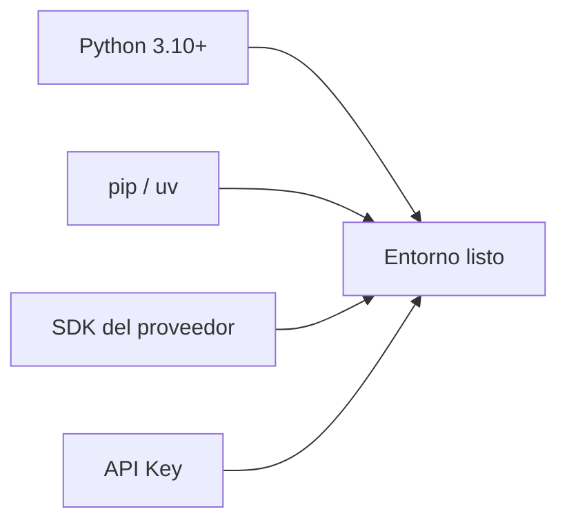
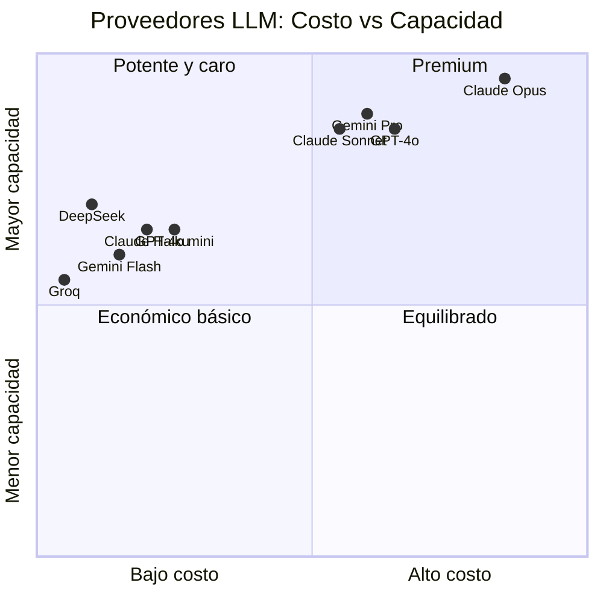

# Sesión 2 — Entorno de Desarrollo

**Fecha:** 2026-03-28
**Duración:** ~1 hora
**Estado:** 🔄 En curso

---

## Objetivos

- Configurar Python y las dependencias necesarias.
- Entender cómo conectarse a cualquier LLM desde código.
- Tener un script de prueba funcionando con el proveedor de tu elección.

---

## 1. ¿Qué necesitamos?



El flujo es siempre el mismo sin importar el proveedor:


---

## 2. Verificar Python

```bash
python --version
# Necesitas 3.10 o superior
```

---

## 3. Estructura del proyecto

```
agentes-from-scratch/
├── CLAUDE.md
├── .env                  ← API keys (NUNCA subir al repo)
├── .gitignore
├── curso-agentes/
│   ├── progreso.md
│   ├── sesion-01.md
│   └── sesion-02.md
└── codigo/
    ├── sesion-03/        ← primer agente real
    ├── sesion-04/
    └── ...
```

---

## 4. Configuración del `.gitignore`

Antes de cualquier otra cosa:

```bash
echo ".env" >> .gitignore
```

**Nunca subas tu API key al repo.**

---

## 5. Archivo `.env`

Crea un archivo `.env` en la raíz del proyecto con la key del proveedor que uses:

```bash
# .env  (elige el tuyo)
ANTHROPIC_API_KEY=sk-ant-...
OPENAI_API_KEY=sk-...
GOOGLE_API_KEY=...
DEEPSEEK_API_KEY=sk-...
GROQ_API_KEY=gsk_...
```

---

## 6. Instalación por proveedor

### Anthropic (Claude)

```bash
pip install anthropic python-dotenv
```

**Obtener API Key:** [console.anthropic.com](https://console.anthropic.com) → API Keys → Create Key

Modelos disponibles:
| Modelo | ID | Uso recomendado |
|---|---|---|
| Claude Haiku 4.5 | `claude-haiku-4-5-20251001` | Rápido y barato, pruebas |
| Claude Sonnet 4.6 | `claude-sonnet-4-6` | Equilibrio calidad/costo |
| Claude Opus 4.6 | `claude-opus-4-6` | Máxima capacidad |

---

### OpenAI (GPT)

```bash
pip install openai python-dotenv
```

**Obtener API Key:** [platform.openai.com](https://platform.openai.com) → API Keys → Create

Modelos disponibles:
| Modelo | ID | Uso recomendado |
|---|---|---|
| GPT-4o mini | `gpt-4o-mini` | Rápido y barato, pruebas |
| GPT-4o | `gpt-4o` | Equilibrio calidad/costo |
| o3 | `o3` | Razonamiento avanzado |

---

### Google (Gemini)

```bash
pip install google-genai python-dotenv
```

> ⚠️ **Nota:** El paquete `google-generativeai` está deprecado y ya no recibe actualizaciones.
> Usar siempre `google-genai` (nuevo SDK oficial).

**Obtener API Key:** [aistudio.google.com](https://aistudio.google.com) → Get API Key

Modelos disponibles:
| Modelo | ID | Uso recomendado |
|---|---|---|
| Gemini 2.0 Flash | `gemini-2.0-flash` | Rápido y barato, pruebas |
| Gemini 2.5 Pro | `gemini-2.5-pro-preview-03-25` | Máxima capacidad |

> ⚠️ **Error 429 - Quota Exhausted (free tier):** Si ves este error con `gemini-2.0-flash`,
> significa que el free tier de tu proyecto alcanzó su límite.
> Opciones:
> - Esperar al reset diario (medianoche hora del servidor de Google)
> - Habilitar billing en [console.cloud.google.com](https://console.cloud.google.com) (tiene capa gratuita generosa)

---

### DeepSeek

```bash
pip install openai python-dotenv
# DeepSeek usa la misma interfaz que OpenAI
```

**Obtener API Key:** [platform.deepseek.com](https://platform.deepseek.com) → API Keys

Modelos disponibles:
| Modelo | ID | Uso recomendado |
|---|---|---|
| DeepSeek Chat | `deepseek-chat` | Uso general |
| DeepSeek Reasoner | `deepseek-reasoner` | Razonamiento / cadena de pensamiento |

---

### Groq (modelos open-source ultra-rápidos)

```bash
pip install groq python-dotenv
```

**Obtener API Key:** [console.groq.com](https://console.groq.com) → API Keys

Modelos disponibles:
| Modelo | ID | Uso recomendado |
|---|---|---|
| LLaMA 3.3 70B | `llama-3.3-70b-versatile` | Uso general |
| Mixtral 8x7B | `mixtral-8x7b-32768` | Contexto largo |

---

## 7. Script de prueba (genérico)

Elige el bloque de tu proveedor:

### Anthropic (Claude)

```python
# codigo/sesion-02/test_conexion.py
import anthropic
import os
from dotenv import load_dotenv

load_dotenv()

client = anthropic.Anthropic(api_key=os.environ["ANTHROPIC_API_KEY"])

response = client.messages.create(
    model="claude-haiku-4-5-20251001",
    max_tokens=64,
    messages=[{"role": "user", "content": "Di 'conexión exitosa' y nada más."}]
)

print(response.content[0].text)
```

---

### OpenAI (GPT)

```python
# codigo/sesion-02/test_conexion.py
from openai import OpenAI
import os
from dotenv import load_dotenv

load_dotenv()

client = OpenAI(api_key=os.environ["OPENAI_API_KEY"])

response = client.chat.completions.create(
    model="gpt-4o-mini",
    max_tokens=64,
    messages=[{"role": "user", "content": "Di 'conexión exitosa' y nada más."}]
)

print(response.choices[0].message.content)
```

---

### Google (Gemini)

```python
# codigo/sesion-02/test_conexion.py
from google import genai
import os
from dotenv import load_dotenv

load_dotenv()

client = genai.Client(api_key=os.environ["GOOGLE_API_KEY"])

response = client.models.generate_content(
    model="gemini-2.0-flash",
    contents="Di 'conexión exitosa' y nada más."
)

print(response.text)
```

---

### DeepSeek

```python
# codigo/sesion-02/test_conexion.py
from openai import OpenAI
import os
from dotenv import load_dotenv

load_dotenv()

client = OpenAI(
    api_key=os.environ["DEEPSEEK_API_KEY"],
    base_url="https://api.deepseek.com"
)

response = client.chat.completions.create(
    model="deepseek-chat",
    max_tokens=64,
    messages=[{"role": "user", "content": "Di 'conexión exitosa' y nada más."}]
)

print(response.choices[0].message.content)
```

---

### Groq

```python
# codigo/sesion-02/test_conexion.py
from groq import Groq
import os
from dotenv import load_dotenv

load_dotenv()

client = Groq(api_key=os.environ["GROQ_API_KEY"])

response = client.chat.completions.create(
    model="llama-3.3-70b-versatile",
    max_tokens=64,
    messages=[{"role": "user", "content": "Di 'conexión exitosa' y nada más."}]
)

print(response.choices[0].message.content)
```

---

## 8. Comparación rápida de proveedores



---

## Checklist Sesión 2

- [ ] Python 3.10+ verificado
- [ ] `.env` creado con mi API Key
- [ ] `.env` en `.gitignore`
- [ ] SDK instalado (`pip install ...`)
- [ ] Script de prueba ejecutado — respuesta: `conexión exitosa`

---

## Evaluación

<details>
<summary><strong>Pregunta 1</strong> — ¿Por qué nunca debes subir el archivo <code>.env</code> al repositorio?</summary>

**Respuesta:** Porque contiene tu API Key. Si la subes, cualquiera con acceso al repo puede usarla para hacer llamadas a la API a tu costo. Las API Keys expuestas en repos públicos son una vulnerabilidad de seguridad crítica.

</details>

<details>
<summary><strong>Pregunta 2</strong> — ¿Qué tienen en común todos los proveedores en cuanto al flujo de conexión?</summary>

**Respuesta:** Todos siguen el mismo patrón: instalar un SDK, configurar la API Key como variable de entorno, crear un cliente con esa key y enviar un mensaje. El flujo es: código → SDK → API del proveedor → respuesta.

</details>

<details>
<summary><strong>Pregunta 3</strong> — DeepSeek usa el mismo SDK que OpenAI. ¿Qué parámetro cambia para apuntar a DeepSeek en lugar de OpenAI?</summary>

**Respuesta:** El parámetro `base_url` en el constructor del cliente: `base_url="https://api.deepseek.com"`. Esto redirige las llamadas al servidor de DeepSeek en lugar de OpenAI, manteniendo el mismo formato de API.

</details>

<details>
<summary><strong>Pregunta 4</strong> — Si quieres hacer pruebas rápidas y baratas, ¿qué modelo elegirías de cada proveedor?</summary>

**Respuesta:**
- Anthropic: `claude-haiku-4-5-20251001`
- OpenAI: `gpt-4o-mini`
- Google: `gemini-2.0-flash`
- DeepSeek: `deepseek-chat`
- Groq: `llama-3.3-70b-versatile` (además es el más rápido)

</details>
